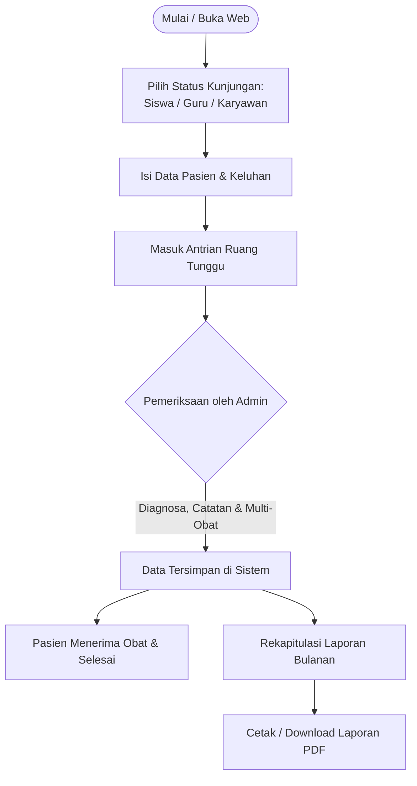

# 🏥 Sistem Informasi UKS - SMA BOPKRI 1 Yogyakarta

[](https://www.php.net/)
[](https://www.mysql.com/)
[](https://developer.mozilla.org/en-US/docs/Web/JavaScript)
[](LICENSE)

**Sistem Informasi Usaha Kesehatan Sekolah (UKS)** adalah aplikasi berbasis web yang dirancang untuk mengelola alur operasional layanan kesehatan di **SMA BOPKRI 1 Yogyakarta**. Sistem ini mempermudah proses pendaftaran kunjungan, antrian ruang tunggu pasien, pemeriksaan klinis oleh petugas medis/admin, pencatatan multi-obat dan diagnosa, hingga rekapitulasi data & cetak laporan dalam format PDF.

---

## 📋 Daftar Isi
- [Fitur Utama](#-fitur-utama)
- [Teknologi yang Digunakan](#-teknologi-yang-digunakan)
- [Struktur Folder](#-struktur-folder)
- [Persyaratan Sistem](#-persyaratan-sistem)
- [Panduan Instalasi](#-panduan-instalasi)
- [Kredensial Default](#-kredensial-default)
- [Alur Kerja Sistem](#-alur-kerja-sistem)
- [Tangkapan Layar & Alur Sistem](#-tangkapan-layar--alur-sistem)
- [Kontributor & Lisensi](#-kontributor--lisensi)

---

## ✨ Fitur Utama

### 1. 👥 Manajemen Kunjungan Pasien (Siswa, Guru, Karyawan)
- **Kategori Pasien Terpisah**: Mendukung pendaftaran untuk Siswa, Guru, dan Tenaga Kependidikan/Karyawan.
- **Pencarian Data Cepat (Ajax Auto-complete)**: Memudahkan input nama atau NIS siswa langsung dari basis data tanpa mengetik ulang secara manual.
- **Pencatatan Keluhan Awal**: Pasien dapat memasukkan keluhan kesehatan saat mendaftar.

### 2. ⏳ Ruang Tunggu Pasien Real-Time
- Tampilan antrian status medis yang informatif untuk masing-masing kategori.
- Pasien dapat melihat status apakah masih dalam antrian, sedang diperiksa, atau telah selesai.
- Menampilkan rincian resep obat yang diberikan beserta jumlah (kuantitas) obat dan instruksi perawatan dari petugas.

### 3. 🩺 Dashboard & Panel Pemeriksaan Admin
- **Statistik & Monitoring Antrian**: Menampilkan total kunjungan pasien aktif hari ini dan pasien yang belum diperiksa.
- **Pemeriksaan Klinis Fleksibel**:
  - Diagnosa jenis penyakit menggunakan input pencarian interaktif (*Select2*).
  - **Dukungan Multi-Obat**: Petugas dapat menambahkan beberapa resep obat sekaligus secara dinamis beserta jumlah (kuantitas) per butir/strip/botol.
  - Catatan instruksi penanganan dan status akhir pasien (Istirahat di UKS / Kembali ke Kelas / Dirujuk / Pulang).
- **Filter Top Kunjungan**: Menampilkan data statistik siswa/guru/karyawan yang sering berkunjung (filter 3x, 4x, 5x kunjungan per bulan/tahun).
- **Pembersihan Otomatis**: Menghapus data kunjungan yang kedaluwarsa/tidak diperiksa lebih dari 24 jam secara otomatis untuk menjaga integritas basis data.

### 4. 📄 Rekapitulasi & Export Laporan PDF
- Cetak riwayat kunjungan dan rekam medis lengkap per kategori (Siswa, Guru, Karyawan) ke dalam format dokumen PDF resmi menggunakan library **Dompdf**.
- Filter laporan berdasarkan rentang tanggal/periode tertentu.

---

## 🛠 Teknologi yang Digunakan

- **Backend**: PHP (Native Procedural & MySQLi)
- **Database**: MySQL / MariaDB
- **Frontend**: HTML5, CSS3 (Modern Responsive UI, Custom Theme UKS BOPKRI 1, Flexbox Layout), JavaScript, jQuery
- **Komponen & Library**:
  - [Select2](https://select2.org/) - Dropdown interaktif & auto-complete data
  - [Dompdf](https://github.com/dompdf/dompdf) - PDF Generator untuk cetak laporan
  - [Composer](https://getcomposer.org/) - PHP Dependency Manager

---

## 📂 Struktur Folder

```text
UKS/
│
├── admin/                      # Modul Admin & Petugas Medis
│   ├── semua_hal_admin/        # Halaman riwayat data & cetak laporan PDF (Siswa/Guru/Karyawan)
│   ├── dashboard.php           # Dashboard utama admin & statistik
│   ├── periksa.php             # Form diagnosa klinis & resep obat multi-item
│   ├── lihat.php               # Detail rincian hasil pemeriksaan
│   ├── detail_v_obat.php       # Detail riwayat obat pasien
│   ├── hapus.php               # Penghapusan riwayat kunjungan
│   ├── login.php               # Halaman login petugas admin
│   ├── proses_login.php        # Autentikasi sesi & keamanan password hash
│   ├── logout.php              # Penghentian sesi
│   └── reset_password.php      # Reset password akun
│
├── assets/                     # Aset gambar & icon
│   └── images/
│       └── logo.png            # Logo resmi UKS BOPKRI 1
│
├── config/                     # Konfigurasi aplikasi
│   └── koneksi.php             # Konfigurasi koneksi MySQLi
│
├── database/                   # Skema dan data awal database
│   └── uks.sql                 # Dump database lengkap
│
├── pasien/                     # Form pendaftaran pasien
│   ├── pilih_status_kunjungan.php # Halaman awal pemilihan status pasien
│   ├── pasien_siswa.php        # Form kunjungan siswa
│   ├── pasien_guru.php         # Form kunjungan guru
│   ├── pasien_karyawan.php     # Form kunjungan karyawan
│   ├── get_siswa.php           # Ajax endpoint cari siswa
│   ├── get_guru.php            # Ajax endpoint cari guru
│   └── get_karyawan.php        # Ajax endpoint cari karyawan
│
├── ruang_tunggu/               # Halaman antrian & status pasien
│   ├── ruang_tunggu_siswa.php
│   ├── ruang_tunggu_guru.php
│   └── ruang_tunggu_karyawan.php
│
├── template/                   # Template komponen antarmuka
│   ├── header.php              # Header navigasi bersama
│   └── footer.php              # Footer bersama
│
├── vendor/                     # Library dependensi Composer (Dompdf dll)
├── .gitignore                  # Konfigurasi ignore file Git
├── composer.json               # Konfigurasi dependensi Composer
├── index.php                   # Entry point (redirect ke halaman pendaftaran)
└── README.md                   # Dokumentasi proyek
```

---

## 💻 Persyaratan Sistem

Pastikan lingkungan server Anda memenuhi spesifikasi berikut:
- **Web Server**: Apache (XAMPP / Laragon / WampServer / LAMP Stack)
- **PHP**: Versi 7.4 atau versi 8.0 ke atas
- **MySQL / MariaDB**: Versi 5.7+ / 10.4+
- **Browser**: Google Chrome, Mozilla Firefox, Microsoft Edge, atau Safari (Terbaru)

---

## 🚀 Panduan Instalasi

Ikuti langkah-langkah berikut untuk menjalankan proyek di komputer lokal:

### 1. Clone Repositori
Clone repositori ini ke dalam direktori `htdocs` web server lokal Anda (misal `C:/xampp/htdocs/`):
```bash
cd C:/xampp/htdocs
git clone https://github.com/Alfred-Sam/UKS.git
cd UKS
```

### 2. Import Database
1. Buka browser dan akses **phpMyAdmin** di `http://localhost/phpmyadmin/`.
2. Buat basis data baru bernama `uks`.
3. Pilih database `uks`, lalu klik tab **Import**.
4. Pilih file `database/uks.sql` yang ada di dalam folder proyek ini, kemudian klik **Import** / **Kirim**.

### 3. Konfigurasi Koneksi (Opsional)
Jika Anda menggunakan username/password MySQL yang berbeda, sesuaikan pengaturannya di file `config/koneksi.php`:
```php
<?php
$koneksi = mysqli_connect("localhost", "root", "PASSWORD_ANDA", "uks");

if (!$koneksi) {
    die("Koneksi ke database gagal: " . mysqli_connect_error());
}
?>
```

### 4. Akses Aplikasi
- **Halaman Utama Pasien**:
  Akses URL: [http://localhost/UKS/](http://localhost/UKS/)
- **Halaman Login Admin**:
  Akses URL: [http://localhost/UKS/admin/login.php](http://localhost/UKS/admin/login.php)

---

## 🔑 Kredensial Default

Akun administrator default yang tersedia pada database:

| Role | Username | Password Default |
| :--- | :--- | :--- |
| **Admin UKS** | `admin` | `admin123` |

> 🔒 *Catatan: Untuk keamanan, Anda dapat mengganti password admin melalui menu akun atau menggunakan utilitas password hash bawaan.*

---

## 🔄 Alur Kerja Sistem



---

## 📄 Lisensi

Proyek ini dikembangkan untuk kebutuhan operasional **UKS SMA BOPKRI 1 Yogyakarta**.  
Dirilis di bawah lisensi [MIT License](LICENSE).
